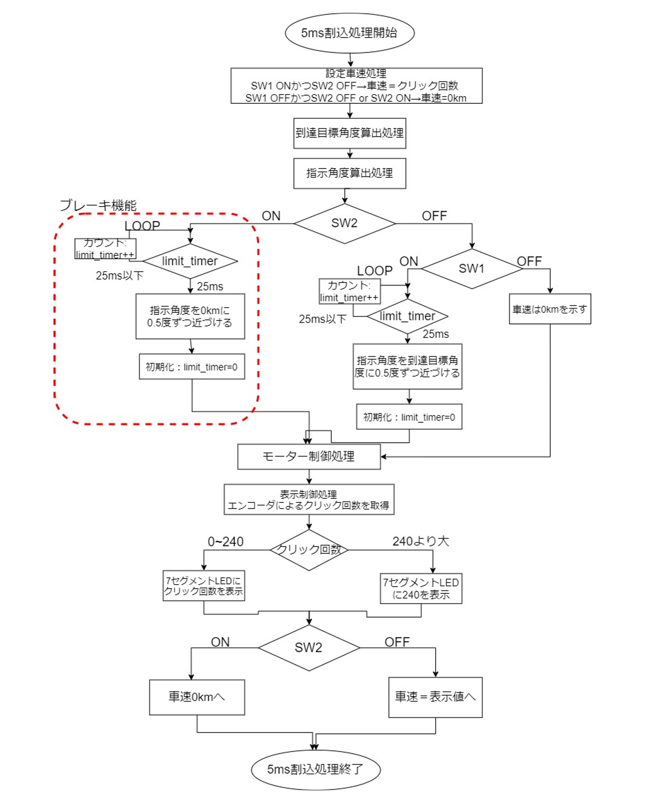

## 概要
組込みシステムの実験で作成したプログラムです。

## 目的
- 組込みシステム特有のクロス開発を体験し、組込みソフト開発の基礎を習得する。
- 組込み開発の基礎技 術を理解することにより、ハード制御の基礎及び組込みシステムの設計能力の基礎を習得する。
- 入出力ボードとライブラリソフトウェアを利用して実現できる製品を考案し、ソフトウェアを作成する。

## 使用機器
- マイコンボード(NS・コンピュータサービス社)
- 統合開発環境 TM(Renesas Electronics 社)

## 作成した機能
- エンコーダ操作によて得られるクリック回数を 7 セグメント LED に表示し、SW1 を ON にするとその値に 向かってスピードメータが 25ms 毎に 0.5km/h ずつ上昇する。 
- スピードメータの上昇が終わってから、さらにエンコーダを増減させると、その分だけスピードメータがク リックと同時に動作する。 
- SW2 を ON にするとブレーキが作動し、0km に向かって 25ms 毎に 0.5km/h ずつ減速する。

## プログラムを実行したときの様子
| この結果から作成した機能が実装されていることが確認できた。

## ソースコード(main.c)の説明
- 設定車速 の分解能は 0.1km/h であるため、スピードメータが示す設定車速の値 (変数 speed) は、7 セグメント LED に表示 する値 (変数 value) を 10 倍した数である。
- 「指示角度算出処理」の関数は、SW1,2 をそれぞれ ON にしたときにスピードメータが動く速さを、どちらも 25ms ごとに 0.5km ずつ動くようにした。 
- 「表示制御処理」の関数では、エンコーダの増減によって 7 セグメント LED に表示する値を変化させている。a には空白、b～d にはエンコーダ操作によって得られたクリック回数の 100 位桁～1 位桁を抽出して表示させている。
- このプログラムでは、スピードメータの目盛の上限が 240km のため、以下のような場合分 けをしている。
  - 設定車速の表示値が 0 から 240 までの場合 (73～80 行目) エンコーダ操作によって得られたクリック回数を表示する。 
  - 設定車速の表示値が 240 を超える場合 (81～88 行目) 表示する設定車速を 240 で固定する。
  
以上の機能から、SW1とSW2を操作したときの動作の場合分けを以下の表に示す。

| SW1 | SW2 | スピードメーターの様子 |
| --- | --- | -------------------- |
| OFF | OFF |        0Kmを示す      |
|  ON | OFF | クリック回数で7セグメントLEDで示した設定車速に向かって上昇する |
|  ON |  ON | SW1による速度の上昇を止め、25ms毎に0.5km/hずつ0Kmに向かって減速する |
| OFF |  ON | 設定車速から0Kmに向かって25ms毎に0.5km/hずつ減速する |

## フローチャート
このプログラムのフローチャート図を以下に示す。

